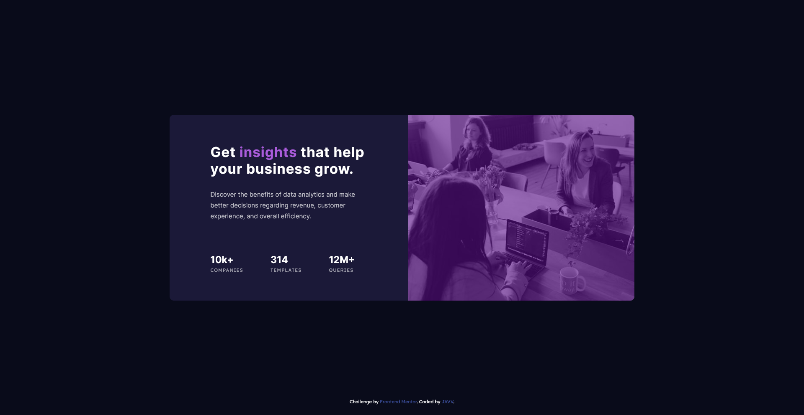

# Stats Preview Card Component - Frontend Mentor

Hello everyone, welcome to my repository 😁!

This is my solution to the [Stats preview card component challenge on Frontend Mentor](https://www.frontendmentor.io/challenges/stats-preview-card-component-8JqbgoU62). 

## Table of contents

- [Overview](#overview)
  - [The challenge](#the-challenge)
  - [Screenshot](#screenshot)
  - [Links](#links)
- [My process](#my-process)
  - [Built with](#built-with)
  - [What I learned](#what-i-learned)
- [Author](#author)

## Overview

### The challenge

Users should be able to:

- View the optimal layout depending on their device's screen size

### Screenshot

### Links

- Solution URL: [Github](https://github.com/daisukeeita/Stat-Preview-Card-Component)
- Live Site URL: [Stats Preview Card Component](https://daisukeeita.github.io/Stat-Preview-Card-Component/)

### Built with

- Semantic HTML5 markup
- CSS custom properties
- Flexbox
- Mobile-first workflow

### What I learned

    What I learned in this challenge is the planning of the 'ecosystem' in programming. Since this challenge looks like a simple one, I thought that this is going to be a fast challenge. And without looking very well at the given design and materials, I was stuck at the weird looking image once I got into the desktop section and, oh-boy, I need to re-structure the HTML itself due to having two different set of images. 

## Author

- Frontend Mentor - [@daisukeeita](https://www.frontendmentor.io/profile/daisukeeita)